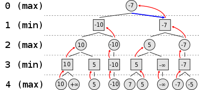

# MiniMax Tree

MiniMax is a branch of game theory where the idea is you want to minimise the maximum loss. Typically there are two players involved, one attempts to
maximise the score while the other attempts to get as low a score as possible. At each node they alternate who chooses the next branch to go down.

An example of a minimax tree:

Source: https://en.wikipedia.org/wiki/Minimax

In this challenge, your aim is to construct the Minimax tree given all the potential outcomes. The first move is made by Player One, whose goal is to maximise their potential score. You are provided a MiniMax class and a Node
class. Refer to the scaffold for information on each of the functions.

### Notes
* In this challenge, the Minimax tree is a binary tree
* The number of outcomes provded will be a power of 2
* The Node constructor can have any parameters you feel necessary
* Leaf nodes should have null for both children